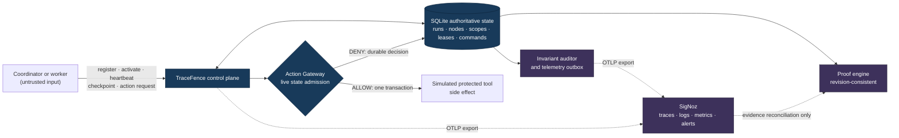
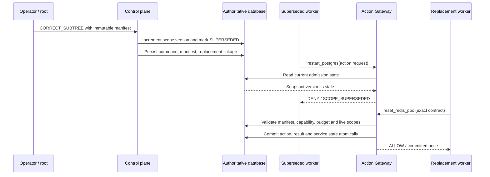

# TraceFence

Runtime-enforced cancellation and correction for dynamic AI-agent graphs.

TraceFence prevents cancelled, superseded, or otherwise stale agent branches from committing
protected side effects. It is a control plane for agent systems where a worker can be delayed,
wrong, or non-cooperative. The control plane—not a prompt, cancellation message, or telemetry
dashboard—is the authority that decides whether a protected side effect may commit.

> A registered descendant may keep computing after its work is cancelled or superseded, but it
> cannot commit a TraceFence-mediated side effect once any inherited control scope is stale.

TraceFence is a reference implementation. It uses simulated protected tools and SQLite, and live
SigNoz reconciliation remains an external verification gate. See
[Limitations](#limitations-and-non-goals) for deployment boundaries.

## What it solves

Agent graphs change while they run. A supervisor can cancel one branch, supersede it with a
correction, and allow unrelated branches to continue. In an ordinary workflow, a stale worker
may still perform an action after it receives a cancellation too late. TraceFence closes that gap
at the side-effect boundary.

The included scenario models a database investigation:

1. a branch investigates PostgreSQL;
2. stronger Redis evidence supersedes that branch;
3. a released non-compliant descendant tries to restart PostgreSQL and is denied;
4. a replacement, bound to an immutable recovery contract, resets the Redis pool exactly once;
5. a proof reconstructs what happened from authoritative state and, when configured, live
   telemetry.

Typical local result:

```text
restart_postgres                 DENY / SCOPE_SUPERSEDED
reset_redis_pool                 ALLOW / committed once
postgres restart count           0
redis and checkout state         healthy
runtime verdict                  VERIFIED
telemetry verdict                UNAVAILABLE (without a live SigNoz gate)
overall verdict                  UNAVAILABLE
```

`UNAVAILABLE` is intentional here. A runtime-only proof is not relabelled as fully verified
when mandatory telemetry evidence was not available.

## Architecture

### Authority is at the action gateway



SigNoz supplies independent evidence; it never grants authority. The Action Gateway evaluates
current authoritative state in the same transaction that admits a simulated side effect.

## What happens when a branch is superseded



The stale worker may keep doing CPU work, but its PostgreSQL restart is denied at the protected
side-effect boundary. The replacement is allowed only after its exact recovery contract and live
authority pass. A scope change on one branch does not invalidate unrelated sibling branches.

## Core concepts

| Term | Meaning |
| --- | --- |
| **Run** | One isolated agent-graph execution and its authoritative aggregate. |
| **Node** | A registered agent with a parent, role, capabilities, lease and owned scope. |
| **Scope** | A versioned authority boundary. A node carries an immutable snapshot of every inherited scope. |
| **Command** | A durable cancellation or correction decision with exact issuer, target, version and idempotency binding. |
| **Replacement manifest** | The immutable contract for correction: exact tool, arguments digest, role, behavior, capabilities, budget, postconditions and stability window. |
| **Action Gateway** | The only admission path for protected tool actions. It checks live state and commits allow/deny outcomes durably. |
| **Proof** | A revision-consistent reconstruction of command convergence, replacement lineage and recovery outcome. |
| **Telemetry watermark** | A same-process/build export observation required before telemetry can be `VERIFIED`. |

## Safety model

TraceFence preserves these practical invariants:

- Every node registers before acting; ancestry and owned scopes are server-authoritative.
- A scope status or version change lazily invalidates its subtree without enumerating it on the
  control path.
- Every protected side effect goes through the central Action Gateway.
- Gateway admission reads live run, node, lease, scope, capability, manifest and idempotency
  state in the same transaction as the decision.
- Command and action idempotency are bound to the authenticated principal, run and canonical
  request digest. A reused key with different content conflicts.
- Corrections enforce their exact recovery manifest *before* execution, including the tool,
  argument digest, replacement identity and committed-invocation limit.
- Terminal runs are immutable; expired leases cannot be revived; cancelled or superseded nodes
  cannot renew their leases.
- Credentials are stored as HMAC digests. Exact retries use short-lived authenticated encrypted
  recovery envelopes; raw long-lived credentials are not persisted or logged.
- Proofs are guarded by an authoritative proof-relevant revision. A changed revision causes a
  bounded retry or a fail-closed `STATE_CHANGED_DURING_PROOF`, never stale `VERIFIED` output.
- Missing, malformed, ambiguous, cross-command, cross-run, stale, or contradictory telemetry
  cannot become `VERIFIED`.

For the full state and transaction design, see [ARCHITECTURE.md](ARCHITECTURE.md). For threat
boundaries and operator guidance, see [SECURITY.md](SECURITY.md).

## Quick start

This is the shortest local path. It assumes you will configure the four required secrets in
`.env` as described in [Full local setup](#full-local-setup).

```bash
git clone https://github.com/saikiranpulagalla/tracefence.git
cd tracefence

python -m venv .venv
source .venv/bin/activate            # Windows PowerShell: .venv\Scripts\Activate.ps1
python -m pip install --upgrade pip
python -m pip install -e '.[dev,mcp,otel-instrumentation]'

cp .env.example .env
# Populate the required secrets in .env; see Full local setup below.
```

In a first terminal, load the private environment and start the API:

```bash
set -a
source .env
set +a
export PYTHONPATH=src
make api
```

In a second terminal, load the same private environment, then run and verify the scenario:

```bash
make scenario
make verify
```

The API binds to loopback at `http://127.0.0.1:9000/`. For the full setup, quality gates,
endpoints and evidence-handling requirements, continue below.

## Full local setup

### Prerequisites

- Python 3.12+
- Node.js (only for the JavaScript syntax check in `make audit`)
- Git, for evidence and release-artifact provenance checks

Optional live-observability path:

- Docker plus SigNoz Foundry
- a valid SigNoz service-account API key
- an existing SigNoz notification channel

### Create a local development environment

```bash
git clone https://github.com/saikiranpulagalla/tracefence.git
cd tracefence

python -m venv .venv
source .venv/bin/activate            # Windows PowerShell: .venv\Scripts\Activate.ps1
python -m pip install --upgrade pip
python -m pip install -e '.[dev,mcp,otel-instrumentation]'
```

The `make install-*` targets provide convenience installs for the declared requirement sets:

```bash
make install-core    # runtime dependencies
make install-dev     # runtime + test/static-analysis tools
make install-full    # development + MCP/OTel dependencies
```

For a hash-locked development and MCP/OTel environment, install the committed locks directly,
then install the package without resolving dependencies again:

```bash
python -m pip install --require-hashes \
  -r requirements-lock/development.txt \
  -r requirements-lock/full.txt
python -m pip install --no-deps -e .
```

### Configure local secrets safely

```bash
cp .env.example .env
chmod 600 .env
```

Generate four independent values and put them only in the ignored `.env` file:

```bash
python -c "import secrets; print(secrets.token_urlsafe(32))"  # operator key
python -c "import secrets; print(secrets.token_urlsafe(48))"  # token-hash secret
python -c "import secrets; print(secrets.token_urlsafe(48))"  # credential-recovery key
python -c "import secrets; print(secrets.token_urlsafe(48))"  # evidence-signing key
```

Load the values only into each terminal that runs TraceFence:

```bash
set -a
source .env
set +a
export PYTHONPATH=src
```

Never commit `.env`, evidence-signing keys, service-account keys, activation tokens, or node
credentials. Outside `TRACEFENCE_ENV=test`, startup rejects missing, placeholder-like, reused,
or undersized secrets.

### Run the local quality gate

```bash
make test
make audit
python -m build
make release-artifacts
```

`make test` runs ordinary tests hermetically: it disables live OTLP and SigNoz access so a
developer's shell cannot accidentally turn a local unit run into a live integration test. The
credential-gated MCP contract test remains an explicit opt-in gate.

### Start the control plane and scenario

In one terminal with the private environment loaded:

```bash
make api
```

In another terminal with the same private environment loaded:

```bash
make scenario
make verify
```

| Endpoint | Purpose |
| --- | --- |
| `http://127.0.0.1:9000/` | Local operator UI |
| `http://127.0.0.1:9000/docs` | OpenAPI documentation |
| `http://127.0.0.1:9000/livez` | Shallow liveness check |
| `http://127.0.0.1:9000/readyz` | Protected readiness details |

The scenario is synchronized by explicit events, not guessed sleeps. It writes signed evidence
only from a clean committed worktree with `TRACEFENCE_EVIDENCE_SIGNING_KEY` set. Read
[evidence/README.md](evidence/README.md) before handling that output.

## Daily command reference

| Goal | Command | Notes |
| --- | --- | --- |
| Run ordinary tests | `make test` | Hermetic; expected live MCP test is skipped. |
| Run static/security/coverage gates | `make audit` | Includes compileall, JavaScript syntax, Ruff, mypy, Bandit, pip-audit and branch coverage. |
| Build distributables | `python -m build` | Produces wheel and source distribution. |
| Generate release metadata | `make release-artifacts` | Generates source lock, SBOM, dependency audit and redacted secret-scan report. |
| Start local API | `make api` | Serves loopback port 9000. |
| Run a scenario | `make scenario` | Requires the API and private runtime environment. |
| Verify signed runtime evidence | `make verify` | Requires fresh, commit-bound evidence and authenticated live API. |
| Reset the configured local database | `make reset` | Refuses unsafe paths and requires the expected database path. |
| Deploy local SigNoz | `make signoz` | Requires Docker and Foundry; environment-specific receipt is ignored by Git. |
| Provision/verify SigNoz resources | `make provision-signoz` / `make verify-signoz` | Requires a valid service account and existing notification channel. |
| Require live telemetry in evidence verification | `make verify-all` | A release gate, not a local substitute. |

Use `make help` for the authoritative target list. Do not run `make clean` against data or
evidence you intend to retain.

## Runtime, proof and telemetry verdicts

Runtime proof checks control convergence, replacement lineage, recovery action, postcondition,
stability and outcome. Telemetry reconciliation separately checks exact command, run, action,
node, scope/version, process, service, build and time-window correlation.

The canonical severity order is deliberately fail-closed:

| Verdict | Meaning |
| --- | --- |
| `INCONSISTENT` | Authoritative state and evidence contradict each other. |
| `STATE_CHANGED_DURING_PROOF` | No stable proof-relevant revision was available within the retry bound. |
| `INCOMPLETE` | Required authoritative runtime evidence is missing or unfinished. |
| `PARTIAL` | An available evidence provider completed only part of its required contract. |
| `UNAVAILABLE` | A mandatory provider could not be consulted. |
| `VERIFIED` | Every mandatory runtime and telemetry dimension verifies. |

`INCONSISTENT` always dominates weaker outcomes. In particular, runtime `VERIFIED` + telemetry `UNAVAILABLE` = overall `UNAVAILABLE`; it is never relabelled `PARTIAL` or `VERIFIED`.

## Optional SigNoz path and live release gate

Local tests do not need SigNoz. Live telemetry verification does.

```bash
# Deploy only in an approved local/ephemeral environment.
make signoz

# Use private environment variables; never commit these values.
export SIGNOZ_URL=http://localhost:8080
export SIGNOZ_MCP_URL=http://localhost:8000/mcp
export SIGNOZ_API_KEY='...'
export TRACEFENCE_NOTIFICATION_CHANNEL='existing-channel-name'
```

`casting.source.lock.json` is a Git-tracked digest of reviewed Foundry source configuration.
Foundry creates `casting.yaml.lock` as an environment-specific deployment receipt. The receipt
is ignored by Git and is never accepted as a substitute for the source lock—or vice versa.

With a healthy SigNoz deployment and an explicitly configured service account, use:

```bash
make provision-signoz
make verify-signoz
make scenario
make verify-all
```

Live verification must prove exact runtime/trace/log action-ID equality, same run and command
correlation, same process/service/build identity, and a successful same-process export watermark
after the command. Do not claim telemetry `VERIFIED` until that real environment has succeeded.

## SQLite, migrations and local data

TraceFence intentionally supports SQLite only. Non-SQLite URLs fail before a driver is loaded.
The Alembic baseline is `001_schema_v17`; new local databases can be initialized explicitly:

```bash
TRACEFENCE_DATABASE_URL=sqlite+pysqlite:///./data/tracefence.db \
  python -m alembic upgrade head
```

Connections use foreign keys, WAL mode, a five-second busy timeout and `synchronous=FULL`.
Monitor free disk space and WAL growth, and use SQLite's online backup API or `sqlite3 .backup`
for backups. Do not copy only the main database file while WAL writes are active. Details and
restore guidance are in [ARCHITECTURE.md](ARCHITECTURE.md).

## Limitations and non-goals

TraceFence is not presented as production-ready. Current boundaries include:

- included protected tools are database-backed simulations; real cloud, payment, or infrastructure
  providers need their own idempotency, durable execution outbox and reconciliation design;
- SQLite and process-local rate limits are appropriate for the single-process MVP, not replicated
  high-availability deployments;
- OIDC/JWT, enterprise RBAC, KMS/HSM, PostgreSQL/HA, Kubernetes, multi-region operation and
  full disaster recovery are intentionally out of scope;
- TraceFence constrains registered nodes only while their protected side effects stay behind the
  Action Gateway. It cannot revoke independently held external credentials; and
- live Foundry/SigNoz verification depends on real infrastructure and credentials.

## Further reading

- [ARCHITECTURE.md](ARCHITECTURE.md) — state model, transactions, proof, telemetry and deployment detail
- [SECURITY.md](SECURITY.md) — threat model, secrets and operator security guidance
- [HARDENING_REPORT.md](HARDENING_REPORT.md) — remediation history and current findings
- [evidence/README.md](evidence/README.md) — evidence format and handling
- [DISCLOSURE.md](DISCLOSURE.md) — provenance and AI-assistance disclosure

## Before opening a pull request

Run the local gate, keep generated output out of Git, and preserve the safety model:

```bash
make test
make audit
python -m build
make release-artifacts
git status --short
```

Do not lower coverage, suppress findings broadly, weaken proof/telemetry strictness, or turn a
local runtime result into a live telemetry or production-readiness claim.
