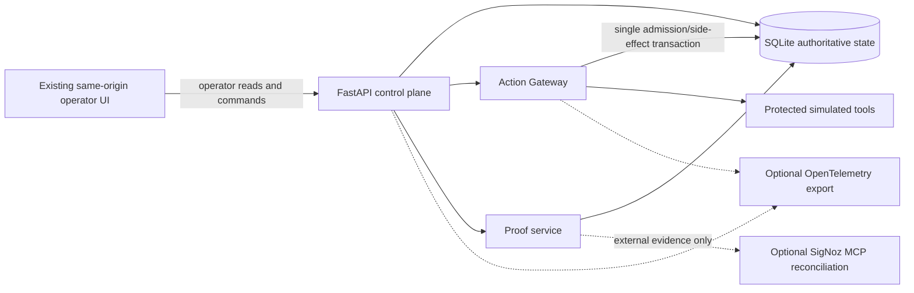
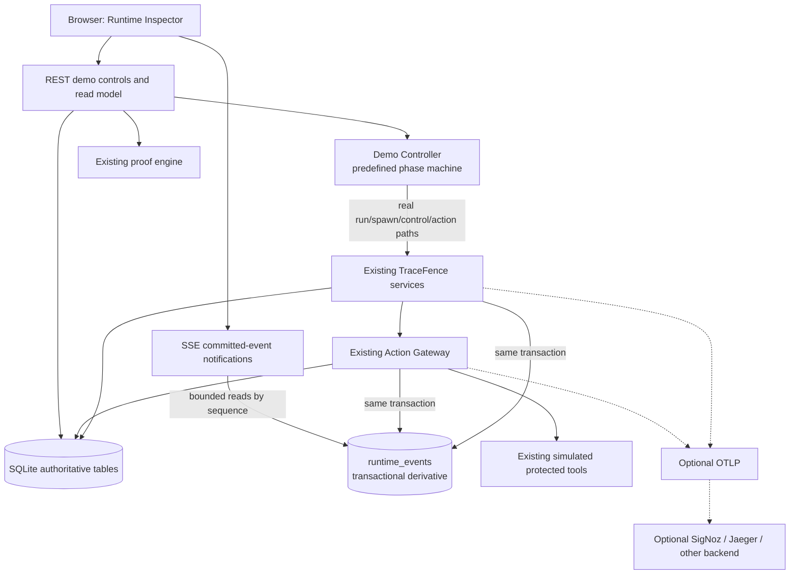

# TraceFence Runtime Inspector Design Review

## Status and scope

This review was prepared before implementation against commit
`819def8810cace1cbdc60b43978295b2276912b5` in the WSL-native repository
`/root/tracefence-signoz-empty-metric-dev`.

The review covers the current runtime, SQLite schema and migration, API routes,
worker lifecycle, proof/evidence code, telemetry and outbox paths, scenario
script, same-origin frontend, tests, recent worker/SigNoz/evidence fixes, and
`reports/TRACEFENCE_DEEP_AUDIT.md`.

The proposed Runtime Inspector is a read projection and demo orchestration
surface. It is not a new authority component. The core Action Gateway,
server-authoritative ancestry and scopes, exact request-bound idempotency,
recovery manifests, lease fencing, and proof verdict lattice remain unchanged.

## Executive decision

TraceFence should extend its existing FastAPI and plain HTML/CSS/JavaScript
application. It does not need a frontend framework or another runtime service.
The existing worker and scenario flow should be reused, but orchestration should
move behind a small, explicitly enabled demo controller with server-enforced
state transitions.

The current tables are sufficient to reconstruct current graph state, commands,
actions, service state, invariant violations, and command proof. They are not
sufficient to reconstruct a complete, stable, globally ordered lifecycle
timeline. Mutable node and scope rows overwrite earlier states, equal timestamps
do not establish a durable total order, and checkpoint/wait/release transitions
are not persisted. The telemetry outbox is deliberately limited to stale
committed-action violations.

Therefore a small append-only `runtime_events` table is justified. It is a
transactional derivative of authoritative state, never a second authority. For
each covered domain transition, the event row must be inserted in the same
SQLite transaction as that transition. If the event cannot be recorded, the
covered transition must not commit. SSE and timeline reads consume this journal;
Action Gateway and control-plane decisions never do.

## Current architecture



## 1. Authoritative runtime state

SQLite owns authoritative runtime state through SQLAlchemy models in
`src/tracefence/db/models.py`, schema initialization and proof-revision triggers
in `src/tracefence/db/engine.py`, and migration
`migrations/versions/001_schema_v17.py`.

The principal authority-bearing rows are:

- `runs`: run lifecycle and monotonically increasing proof revision;
- `nodes`: authoritative parent links, declared lifecycle state, lease,
  capabilities, instruction, and inherited scope snapshot;
- `control_scopes`: live scope version and status;
- `control_commands`: exact control mutation, target, old/new versions,
  replacement parent, manifest, and replacement lifecycle;
- `command_acknowledgements`: cooperative, gateway-block, and lease-expiry
  observations;
- `action_attempts` and `action_command_matches`: admission decision, exact
  request identity, scope comparison, command attribution, and committed result;
- `service_state`: simulated protected side effects and their counts;
- `invariant_violations`: durable stale-commit findings.

The browser, telemetry providers, SigNoz, and the proof cache do not own
authority. `lineage_path` is a display/cache field; authorization walks the
authoritative `parent_id` chain.

## 2. Exact Action Gateway admission path

Admission is performed by `ActionGateway.execute()` in
`src/tracefence/services/action_gateway.py`.

The method:

1. starts `BEGIN IMMEDIATE` on SQLite;
2. loads and authenticates the node;
3. checks exact node-scoped idempotent replay before mutable policy checks;
4. resolves the canonical tool specification;
5. loads the run and evaluates every inherited scope against live rows;
6. checks run status, node status, lease, scope status/version, recovery
   contract, capability, arguments, and invocation budget as applicable;
7. persists a DENY or executes the simulated tool and persists an ALLOW result;
8. commits the decision and simulated side effect in the same transaction.

The current code has one authorization path. The Runtime Inspector must consume
its persisted result and must not reimplement admission.

## 3. ALLOW/DENY persistence

Every admitted action is stored in `action_attempts` with:

- `decision` and `denial_reason`;
- request and argument digests;
- `scope_evaluation_json` containing effective status, mismatches, and live
  scopes;
- exact matched command/scope/snapshot/live fields when a stale command is
  attributable;
- result JSON/digest and `committed_at` for ALLOW only.

`action_command_matches` records every exact command/scope match when inherited
invalid scopes overlap. Database check constraints enforce the DENY and ALLOW
row shapes. `service_state.last_action_id` ties a simulated side effect to its
committed action.

The existing row is enough to explain scope failures and final results. It is
not enough to display every gateway check historically. For example, a row does
not preserve explicit PASS/FAIL results for run status, node state, lease,
capability, manifest, budget, and idempotency. Reconstructing those checks later
from current rows would be incorrect because state may have changed.

## 4. Existing reconstruction data

### Node lifecycle

`nodes` retains registration, activation, last heartbeat, lease expiry,
completion, declared status, process ID, parent, superseded node, and causal
command. `spawn_intents` retains activation intent expiry and consumption.

Missing history: intermediate heartbeats, WAITING/checkpoint arrival, release,
prior statuses, and the exact order when several transitions share a timestamp.

### Scope changes

`control_scopes` retains only the current version/status/reason/updater/time.
`control_commands` preserves each command's `from_version`, `to_version`, target,
reason, and creation time, so command-caused scope changes can be reconstructed.
There is no independent ordered event for initial scope creation or a generic
scope mutation not represented by a command.

### Commands

`control_commands` is durable and largely complete: issuer identity class,
idempotency digest, target node/scope, versions, reason, correction manifest,
replacement parent/node/status, and timestamp. Acknowledgements are separately
durable.

### Leases

`nodes` contains the current `last_heartbeat_at` and `lease_expires_at` only.
Lease expiry becomes a node status and may create acknowledgements. Individual
lease grants and renewals are not historical records.

### Action requests and decisions

`action_attempts` contains the admitted request, final decision, final result,
scope snapshot/live comparison, exact command attribution, and timestamps.
Requests rejected before an authenticated, well-formed admission record do not
belong in the run timeline. Authenticated gateway DENYs do.

### Replacements and recovery

`control_commands` stores the authorized replacement manifest, designated
parent, replacement node, and lifecycle status. `nodes` stores
`supersedes_node_id` and `caused_by_command_id`. Credential recovery envelopes
store only authenticated encrypted short-lived recovery material; raw long-lived
credentials are not stored.

### Proofs

Proof responses are built on demand from authoritative rows. They are
single-flight and conditionally cached, but no proof row is persisted. The
authoritative input revision is persisted on `runs`; the response itself is not
durable runtime history. The deep audit also found an open cached-return revision
race, so the UI must not present a cached result as stronger than the proof
service returns and this feature must not obscure that finding.

## 5. Existing telemetry and outbox

OpenTelemetry emits traces, logs, metrics, and command-bound export watermarks.
It is optional evidence. With no OTLP endpoint, telemetry status is DISABLED and
runtime authority continues.

`telemetry_outbox` is not a general domain-event journal. It contains only
`tracefence.stale_action_committed` events discovered by the invariant auditor.
It provides claim leases, retry/backoff metadata, stable event keys, and
at-least-once external delivery. It should remain specialized for safety
violation export rather than being overloaded for UI history.

## 6. Can current data drive the Inspector?

Partly.

The current graph, action ledger, services, violations, commands, and proof
endpoints can drive a useful current-state inspector. The existing UI already
does this with two-second polling.

They cannot correctly answer “what happened in this run, in order?” across all
required demo steps. A union ordered by mutable-table timestamps cannot recover
checkpoint arrival, release, each lease grant/renewal, prior node state, or a
stable total order. It would also force the frontend to infer semantics from
unrelated row shapes.

## 7. Missing information

The minimum missing information is:

- a durable monotonic per-database sequence for timeline ordering;
- checkpoint/wait and explicit demo release events;
- prior and resulting state for lifecycle transitions;
- initial registration/activation/scope snapshot events;
- historical lease grant/renew/expiry events where the UI promises to show
  them;
- command and scope transition events with old/new versions;
- action request/final decision event linkage;
- a persisted, gateway-produced decision explanation for the exact admission
  attempt;
- demo scenario identity and server-enforced phase so refresh cannot invent
  valid controls.

## 8. Runtime event journal decision

Add one append-only `runtime_events` table in the next formal SQLite migration.
It is a **transactional derivative**, not authority.

Proposed columns:

| Column | Purpose |
| --- | --- |
| `sequence` | SQLite integer primary key; durable total order and SSE event ID |
| `run_id` | required FK and indexed timeline partition |
| `event_type` | strict bounded enum/check constraint |
| `occurred_at` | UTC timestamp for display |
| `node_id`, `parent_node_id` | optional entity links |
| `command_id`, `action_id`, `scope_id` | optional causal links |
| `decision`, `reason_code` | optional decision summary |
| `snapshot_version`, `authoritative_version` | optional authority comparison |
| `metadata_json` | bounded, schema-validated event-specific details without credentials |

Initial event types should be limited to UI requirements:

- `RUN_CREATED`;
- `NODE_REGISTERED`, `NODE_ACTIVATED`, `NODE_WAITING`, `NODE_COMPLETED`;
- `LEASE_GRANTED`, `LEASE_RENEWED`, `LEASE_EXPIRED`;
- `COMMAND_ISSUED`, `SCOPE_CANCELLED`, `SCOPE_SUPERSEDED`;
- `ACTION_REQUESTED`, `ACTION_DENIED`, `ACTION_COMMITTED`;
- `REPLACEMENT_CREATED`, `RECOVERY_COMPLETED`;
- `DEMO_WORKER_RELEASED`.

Event insertion must use one small helper receiving the existing SQLAlchemy
session. Services call it inside their existing transaction. The helper does not
evaluate authority. It validates event shape and records facts already computed
by the authoritative service. Covered transitions fail atomically if event
insertion fails.

Proof start/finish should not initially be journaled: proof is an expensive
read/evidence operation, not an authoritative state mutation, and persisting it
would change the proof revision it is trying to observe. The UI can fetch proof
explicitly and label it with its returned runtime, telemetry, and overall
verdicts.

## 9. Existing demo/scenario infrastructure

Reusable infrastructure already exists:

- `scripts/run_scenario.py` creates a real run, seeds simulated service state,
  spawns/activates branches, launches a real `tracefence.runtime.worker`
  subprocess, waits for activation, commits a real correction, creates and runs
  the replacement, releases the stale worker with `GO`, reads proof, and writes
  evidence;
- `tracefence.runtime.worker` accepts activation material on stdin rather than
  command-line arguments, maintains heartbeats, supports an explicit
  `--wait-for-release` checkpoint, and cleanly handles lease loss and SIGTERM;
- `StateService.seed_scenario()` safely initializes simulated services exactly
  once before execution;
- the scenario routes expose seeding, service reads, and lease scanning;
- existing unit, concurrency, and subprocess tests cover supersession,
  cancellation, sibling isolation, recovery contracts, idempotency, lease
  fencing, linearization, and worker teardown.

The script is currently one-shot and terminal-oriented. It does not expose a
persistent scenario phase machine, cannot be advanced by the UI, and keeps
worker control in its own process. The new controller should extract/reuse its
real API sequence rather than duplicate domain services or mutate rows.

## 10. Current SigNoz coupling

Core run, node, control, lease, gateway, simulated tool, graph, service, and
invariant operations do not require SigNoz or MCP.

Coupling appears in:

- `ProofService`, which always includes a telemetry dimension and may perform
  exporter flush/MCP reconciliation;
- `/readyz` and protected health, which report telemetry/MCP state but do not
  make external readiness runtime authority;
- scenario evidence verification and `verify-all`, which intentionally bind
  release evidence to live external telemetry;
- explicit provisioning and verification scripts.

The current telemetry setup already treats a missing OTLP endpoint as DISABLED.
The canonical verdict is also already correct: runtime VERIFIED plus telemetry
UNAVAILABLE yields overall UNAVAILABLE.

## 11. Coupling safe to remove or isolate

The local demo launcher should explicitly start with OTLP disabled, no SigNoz
API key, no MCP URL use, and no Foundry/Docker dependency. Demo proof should use
the existing proof response and show its three distinct facts:

- runtime verdict;
- external telemetry verdict (`UNAVAILABLE` or `NOT CONFIGURED` presentation);
- canonical overall verdict (`UNAVAILABLE` when telemetry is unavailable).

No runtime mutation may await external proof I/O. The existing separate bounded
external executor should remain. The Inspector should fetch proof only on user
request or after a terminal demo phase, not on every state refresh.

The local `make demo` path should not call `verify-all`, provision SigNoz, flush
an absent exporter, or infer telemetry success.

## 12. SigNoz functionality that stays unchanged

Keep all of the following:

- OTLP traces, logs, metrics, and export watermarks;
- strict SigNoz Query Builder response adapters and identity correlation;
- MCP transport and optional live contract tests;
- dashboard/alert provisioning and verification;
- Foundry source/deployment lock separation;
- release evidence verification and `--require-telemetry` gate;
- canonical proof verdict combination.

SigNoz remains external evidence, never authority. A SigNoz outage may make
telemetry evidence unavailable; it must not grant or deny actions.

## 13. Existing UI technology

The repository serves `src/tracefence/frontend/index.html` and
`src/tracefence/frontend/app.js` directly from FastAPI. The UI is dependency-free
HTML/CSS/JavaScript and already includes:

- readiness status;
- run selection and protected operator reads;
- a node graph and control-command timeline;
- action, service, invariant, and proof panels;
- stale-state clearing on authentication/run changes;
- focus-conscious refresh behavior and two-second polling.

No frontend framework is needed.

## 14. Minimum frontend architecture

Extend the existing files rather than replace them:

- add a demo-mode landing/control strip;
- reuse the graph renderer with explicit WAITING/STALE/EXPIRED states and scope
  snapshot/live versions;
- replace the command-only timeline with the runtime event read model;
- make action rows/events selectable;
- add a decision inspector that renders only persisted gateway checks;
- display runtime, external telemetry, and overall proof verdicts separately;
- keep generic operator controls available outside demo mode.

The frontend stores selection and last event sequence only. It never calculates
authority or legal scenario transitions. Button enablement is convenience; the
server validates every request.

## 15. Browser live updates

Use REST for commands and SSE for committed event notifications.

Proposed endpoint:

`GET /v1/demo/runs/{run_id}/stream`

Design:

- `runtime_events.sequence` is the SSE `id`;
- support `Last-Event-ID` and an explicit `after` query for reconnect tests;
- query SQLite in bounded pages instead of retaining an unbounded per-client
  queue;
- send a lightweight keepalive comment when no event is available;
- close promptly on disconnect/cancellation;
- when a gap exceeds the page limit, send pages in order until caught up;
- UI treats SSE as an invalidation hint and reloads authoritative graph/action
  projections, so losing a browser connection cannot lose runtime state;
- initial page load is always reconstructed from REST/SQLite.

This is modest because SQLite is the durable buffer. If connection cleanup or
streaming tests prove unreliable, retain safe two-second polling for the first
release and document the deferral. Correct reconstruction is more important
than SSE.

## 16. Demo-mode security boundary

Add explicit `TRACEFENCE_DEMO_MODE`, default `false`.

Demo mutation routes must:

- be absent or return 404 when disabled;
- accept requests only from loopback by default;
- be served by `make demo` on `127.0.0.1`;
- expose only predefined scenario names and fixed actions;
- reject arbitrary tools, arguments, paths, shell commands, IDs outside the
  active demo session, and invalid phase transitions;
- never return activation/node/operator/evidence credentials;
- use a random process-local demo session nonce delivered as an HttpOnly,
  SameSite=Strict cookie after a loopback bootstrap request;
- use a separate disposable SQLite file under a resolved, validated demo data
  directory;
- cap active demo runs, workers, SSE clients, event pages, and request sizes;
- terminate owned workers and close transports during reset/shutdown;
- leave existing operator and node authentication unchanged.

The demo controller may hold short-lived node credentials only in process
memory. It must never persist or log them. Refresh works because the controller
session remains in the API process and current state comes from SQLite. A server
restart terminates the demo session and its workers; the UI can still inspect
the committed run read-only but must start a new scenario to mutate it.

The browser does not receive node credentials. The controller invokes the same
public API/service boundaries as the current scenario script using its in-memory
credentials. For the canonical stale-worker path, it launches the existing
worker subprocess and releases it through stdin exactly as the script does.

## 17. Semantics that must remain unchanged

- every agent registers before acting;
- ancestry and owned scopes remain server-authoritative;
- invalidation remains lazy and hierarchical;
- every protected side effect passes through `ActionGateway.execute()`;
- admission reads live state and commits decision/side effect in one SQLite
  transaction;
- stale descendants may continue computing but cannot commit protected effects;
- unrelated sibling branches remain operational;
- idempotency remains exact, node/principal/run/tool/payload bound;
- correction recovery remains bound to exact manifest, parent, node, tool,
  arguments, environment/resources, and invocation budget;
- cancelled/superseded/expired nodes cannot renew leases;
- terminal runs remain immutable;
- raw credentials are not stored or logged;
- proof revision, cache identity, watermark checks, and verdict severity are not
  weakened;
- missing/ambiguous telemetry never becomes VERIFIED;
- runtime VERIFIED plus telemetry UNAVAILABLE remains overall UNAVAILABLE;
- SQLite remains the only supported database;
- protected tools remain simulations;
- TraceFence is not described as production-ready.

## Proposed target architecture



## Canonical deterministic scenario design

The controller persists a small demo scenario record containing scenario name,
run ID, phase, public entity IDs, and timestamps. It does not persist secrets.
Phase transitions use conditional writes and fixed idempotency keys.

Canonical phases:

1. `NEW`: no run;
2. `WAITING_STALE_WORKER`: run, PostgreSQL branch, child worker, sibling, and
   seeded services exist; real worker is activated and waiting for `GO`;
3. `SUPERSEDED`: a real `CORRECT_SUBTREE` command committed and scope moved from
   v1 to v2; the worker process is still alive;
4. `STALE_DENIED`: controller releases the worker; its real
   `restart_postgres` request is persisted as DENY/SCOPE_SUPERSEDED and restart
   count remains zero;
5. `REPLACEMENT_READY`: exact manifest replacement is registered/activated;
6. `RECOVERY_COMMITTED`: real `reset_redis_pool` ALLOW committed exactly once;
7. `PROOF_AVAILABLE`: proof fetched after the configured postcondition stability
   window and shown without requiring telemetry verification;
8. `FINISHED` or `FAILED`: terminal orchestration result with cleanup.

No transition depends on a guessed sleep. Worker activation/waiting uses an
explicit server-visible checkpoint/event and bounded deadline. Postcondition
stability is an existing proof contract and may use a monotonic bounded timer;
it is not used to establish action ordering.

Other scenarios use the same controller and real services:

- cancellation commits `CANCEL_SUBTREE` before releasing the worker;
- lease expiry stops heartbeat and invokes the existing lease scanner after an
  explicit demo-only test clock/lease hook owned by `LeaseService`, never a
  browser database write;
- idempotency repeats the exact same real gateway request and then sends a
  conflicting payload under the same key;
- recovery mismatch invokes the real gateway with a wrong fixed tool/arguments,
  then the exact manifest action;
- sibling isolation creates two branches and proves one remains allowed;
- concurrent stale/valid uses a barrier and two real gateway calls.

If a deterministic lease hook cannot be introduced without altering production
semantics, the lease-expiry demo remains backend-test-only until a scoped clock
abstraction is reviewed. The production seven-second lease is not increased or
weakened for demo convenience.

## Decision explanation design

The gateway should construct one structured explanation while evaluating the
request. This object is data produced by the existing decision path, not a
second evaluator.

Proposed check records are emitted only when actually evaluated:

```json
{
  "schema_version": 1,
  "checks": [
    {"name": "run_active", "outcome": "PASS", "reason": null},
    {"name": "node_active", "outcome": "PASS", "reason": null},
    {"name": "lease_valid", "outcome": "PASS", "reason": null},
    {"name": "scope_current", "outcome": "FAIL", "reason": "SCOPE_SUPERSEDED"}
  ],
  "idempotency": "NEW",
  "final_decision": "DENY",
  "final_reason": "SCOPE_SUPERSEDED"
}
```

Persist it on the `action_attempts` row in the same transaction. Replay responses
return the original explanation with idempotency presented as `REPLAY` in the
response projection, without rewriting historical decision data. Conflicts do
not become action rows because they are rejected against an existing operation;
the demo controller can show the stable conflict response separately.

The schema must distinguish `NOT_APPLICABLE` from an unevaluated check. It must
not claim a manifest or budget check for an ordinary node when none exists.

## Read API

Keep existing `/v1` conventions and add bounded projections:

- `GET /v1/runs/{run_id}/events?after=&limit=`;
- `GET /v1/runs/{run_id}/actions/{action_id}`;
- existing graph, action list, service, violation, and command proof endpoints;
- `GET /v1/demo/sessions/{session_id}` for public scenario state;
- `GET /v1/demo/runs/{run_id}/stream` when demo mode is enabled.

Demo mutations are a separate namespace with fixed transition verbs, for
example:

- `POST /v1/demo/scenarios/{scenario}/start`;
- `POST /v1/demo/sessions/{session_id}/advance`;
- `POST /v1/demo/sessions/{session_id}/supersede`;
- `POST /v1/demo/sessions/{session_id}/cancel`;
- `POST /v1/demo/sessions/{session_id}/release`;
- `POST /v1/demo/sessions/{session_id}/reset`.

The server returns allowed next transitions. The frontend does not derive them.

## One-command launcher

Add `make demo` backed by a small Python launcher that sets demo configuration
before importing the application:

- generate independent process-local secrets without printing them;
- set demo mode and explicitly disable OTLP/MCP/SigNoz use;
- resolve a dedicated demo database path under `data/demo`;
- initialize only that SQLite database;
- bind Uvicorn to `127.0.0.1:9000`;
- print only the Runtime Inspector URL and safe lifecycle instructions;
- handle SIGINT/SIGTERM and terminate controller-owned worker subprocesses.

`make demo-reset` must validate the exact path using the hardened reset logic.
It must not reuse or delete `data/tracefence.db`.

## Verification plan before UI polish

1. Add schema/event and decision-explanation tests.
2. Build the canonical controller and backend integration test.
3. Run the canonical scenario 100 times; stop on the first flake.
4. Test timeline order, graph reconstruction, action explanation, refresh, SSE
   reconnect, duplicate commands, invalid phases, and demo-off behavior.
5. Add the remaining scenario matrix and requested repetitions.
6. Extend the existing UI only after backend stress passes.
7. Use existing JS/static route tests first. Add Playwright only if a minimal,
   locked installation and clean browser execution are practical; otherwise add
   an HTTP/DOM smoke harness and document the limitation.
8. Test UI closed, SSE disconnected, OTLP unavailable, SigNoz unavailable,
   browser refresh, duplicate UI commands, and stale client transitions.
9. Measure run creation, registration, scope change, ALLOW, DENY, event read,
   graph read, and proof read. Address only measured regressions.
10. Run `make test`, `make audit`, `python -m build`, and
    `make release-artifacts` before documentation changes.

## Risks and explicit non-goals

- The open deep-audit proof-cache race remains a release blocker unless fixed in
  its own test-driven change; the Runtime Inspector must not hide it.
- The graph and proof services have measured N+1 behavior. The initial demo is
  bounded to small runs, so optimization should follow measurements.
- A runtime event journal increases write volume. Default graph limits and
  bounded event retention/read pages are required; automatic destructive
  pruning is not part of the first implementation.
- SQLite remains single-host persistence. SSE does not imply multi-process event
  fanout or HA.
- Demo credentials are process-local and demo sessions are not resumable for
  mutation after API restart.
- Simulated tools do not prove provider-side exactly-once behavior. Real tools
  require provider idempotency, outbox, reconciliation, and compensation.
- External telemetry remains an optional local integration and a separate live
  release gate. It is never faked.
- No Kafka, Redis, PostgreSQL, Kubernetes, Docker, Foundry, SigNoz, MCP key, or
  frontend framework is required for the local demo.

## Implementation boundary approved by this review

The smallest coherent implementation is:

1. one formal SQLite migration adding `runtime_events`, a compact demo scenario
   state table, and action decision explanations;
2. transactional event recording in existing services without moving authority;
3. one bounded in-process demo controller that owns real worker subprocesses and
   calls existing services/API paths;
4. bounded read endpoints and optional SSE over the durable sequence;
5. extensions to the existing static frontend;
6. a hermetic `make demo` launcher and a backend-first stress suite;
7. no changes to SigNoz adapters, provisioning, or canonical verdict semantics
   unless a concrete local coupling test demonstrates a defect.

Implementation must not begin until this report exists in the target repository.
